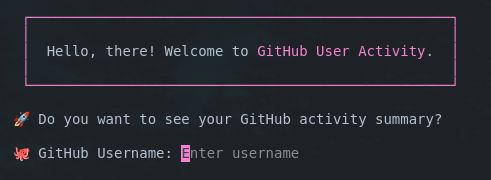
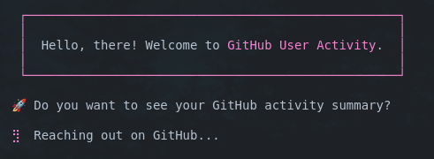
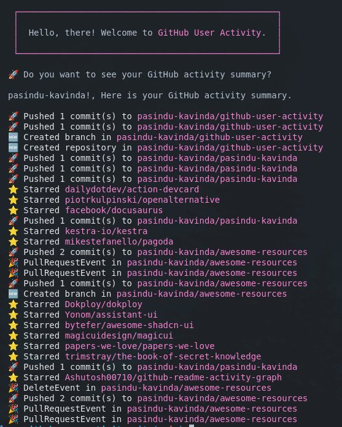

# Github User Activity


> Roadmap.sh Project URL: https://roadmap.sh/projects/github-user-activity

## How to run

- Install [gum](https://github.com/charmbracelet/gum)
- Install [jq](https://jqlang.github.io/jq/download/)

Clone the repository.

```bash
git clone https://github.com/pasindu-kavinda/github-user-activity.git
cd github-user-activity
```

> Make sure to set `show-my-activity.sh` as executable.
```bash
chmod +x show-my-activity.sh
```

Run following commands to list your activities.

```bash
./show-my-activity.sh
```
## Output

Give your GitHub username.


The script will look your activity.


The script will list your activities in the following format.

